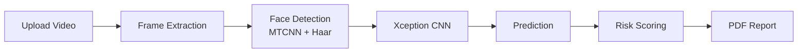

<div align="center">
  
  
  <br>
  <h1>VeriSight</h1>
  <p><strong>AI-Powered Deepfake Video Detection</strong></p>
  <p>
    <em>Designing a Machine Learning-Based Bot for Deepfake Video Detection:<br>
    Addressing Digital Misinformation Among University Students in Ghana.</em>
  </p>
  <p>
    <a href="#"></a>
    <a href="#"></a>
    <a href="#"></a>
    <a href="#"></a>
    <a href="LICENSE"></a>
    <a href="https://railway.app"></a>
  </p>
</div>

---

## Overview

VeriSight is a production-ready Flask web application that detects AI-generated (deepfake) videos using a PyTorch-based Xception convolutional neural network. Built as a final-year cybersecurity project, it provides a complete pipeline from video upload through face detection, frame analysis, and a downloadable PDF report.

---

## Screenshots

| Landing Page | Upload | Results |
|---|---|---|
|  |  |  |
| **Dashboard** | **PDF Report** | **Login** |
|  |  |  |

> **Note:** Replace the placeholder images above with actual screenshots of your deployed app. Upload them to `app/static/screenshots/`.

---

## Features

- **Deepfake Detection** – Xception-based CNN with custom binary classification head
- **Face Detection** – MTCNN with OpenCV Haar cascade fallback for robust face extraction
- **Real-time Analysis** – Frame sampling and batch GPU inference for videos up to 100 MB
- **PDF Reports** – Downloadable professional reports with prediction, confidence, risk level, and recommendations
- **JWT Authentication** – Secure sign-up, login, and token-based API access
- **Paginated History** – Browse past analyses with filtering by status
- **Dark UI** – Modern cybersecurity-themed interface with animated gauges and confidence meters
- **Neon PostgreSQL** – Managed serverless database with connection pooling
- **Railway Ready** – One-click deploy with Nixpacks build configuration

---

## Tech Stack

| Layer | Technology |
|---|---|
| **Backend** | Python 3.12, Flask 3.1 (App Factory + Blueprints) |
| **Database** | Neon PostgreSQL via SQLAlchemy ORM |
| **ML Pipeline** | PyTorch 2.5, timm, OpenCV, MTCNN, NumPy |
| **Auth** | JWT (PyJWT), bcrypt (Flask-Bcrypt) |
| **PDF Engine** | ReportLab 5.0 |
| **Frontend** | Server-rendered Jinja2 templates, vanilla CSS (dark theme) |
| **Deployment** | Railway (gunicorn + Whitenoise) |
| **CI** | GitHub Actions (pytest) |

---

## Installation

### Prerequisites

- Python 3.12+
- PostgreSQL (or a [Neon](https://neon.tech) serverless database)
- Git

### Local Setup

```bash
# 1. Clone the repository
git clone https://github.com/yourusername/verisight.git
cd verisight

# 2. Create and activate a virtual environment
python -m venv venv
source venv/bin/activate        # Linux/macOS
# .\venv\Scripts\activate       # Windows

# 3. Install dependencies
pip install --upgrade pip
pip install -r requirements.txt

# 4. Configure environment variables
cp .env.example .env
# Edit .env with your credentials (see Environment Variables below)

# 5. Initialize the database
flask db init
flask db migrate -m "Initial migration"
flask db upgrade

# 6. Run the development server
flask run
```

Visit **http://localhost:5000** in your browser.

### Environment Variables

| Variable | Required | Default | Description |
|---|---|---|---|
| `FLASK_ENV` | Yes | `development` | Set to `production` on Railway |
| `SECRET_KEY` | Yes | — | Flask session secret (64-char hex) |
| `DATABASE_URL` | Yes | — | PostgreSQL connection string (Neon) |
| `JWT_SECRET` | Yes | — | Token signing secret (separate from above) |
| `JWT_EXPIRATION_HOURS` | No | `24` | Token lifetime in hours |
| `MAX_CONTENT_LENGTH` | No | `104857600` | Max upload size (bytes, 100 MB) |
| `UPLOAD_FOLDER` | No | `uploads` | Video storage directory |
| `MODEL_CONFIDENCE_THRESHOLD` | No | `0.5` | Classification threshold (0–1) |
| `FRAME_SAMPLE_RATE` | No | `1` | Frame sampling interval |
| `MODEL_WEIGHTS_URL` | No | — | URL to download fine-tuned weights |

```bash
# Generate secure secrets
python -c "import secrets; print(secrets.token_hex(32))"
```

### Running Tests

```bash
python -m pytest tests/ -v --tb=short
```

---

## API Reference

All authenticated endpoints require an `Authorization: Bearer <token>` header.

### Authentication

| Method | Endpoint | Auth | Description |
|---|---|---|---|
| `POST` | `/api/auth/register` | — | Create account |
| `POST` | `/api/auth/login` | — | Login, returns JWT + user object |
| `GET` | `/api/auth/profile` | Yes | Get current user profile |
| `PUT` | `/api/auth/profile` | Yes | Update username / email / password |

### Videos

| Method | Endpoint | Auth | Description |
|---|---|---|---|
| `POST` | `/api/videos/upload` | Yes | Upload video (multipart/form-data) |
| `GET` | `/api/videos/<id>/status` | Yes | Get processing status |

### Results

| Method | Endpoint | Auth | Description |
|---|---|---|---|
| `GET` | `/api/results` | Yes | List all results (paginated) |
| `GET` | `/api/results/<id>` | Yes | Get single detection result |
| `GET` | `/api/results/<id>/download` | Yes | Download PDF report |
| `DELETE` | `/api/results/<id>` | Yes | Delete result + uploaded video |

### Query Parameters (List Results)

| Param | Type | Default | Description |
|---|---|---|---|
| `page` | int | `1` | Page number |
| `per_page` | int | `10` | Items per page (max 100) |
| `status` | string | — | Filter by status: `pending`, `processing`, `completed`, `failed` |

---

## Project Structure

```text
VeriSight/
├── app/
│   ├── __init__.py            # App factory, blueprints, error handlers
│   ├── config.py              # Development / Testing / Production config
│   ├── extensions.py          # SQLAlchemy, Migrate, Bcrypt instances
│   ├── models/
│   │   ├── user.py            # User model (email, password, profile)
│   │   ├── uploaded_video.py  # UploadedVideo model
│   │   └── analysis_result.py # AnalysisResult model (prediction, risk, etc.)
│   ├── routes/
│   │   ├── auth.py            # /api/auth/* endpoints
│   │   ├── videos.py          # /api/videos/* endpoints
│   │   ├── results.py         # /api/results/* endpoints
│   │   └── frontend.py        # HTML page routes
│   ├── services/
│   │   ├── auth_service.py    # JWT creation / verification, login_required
│   │   ├── detection_service.py  # GPU model inference pipeline
│   │   └── pdf_report.py      # ReportLab PDF generation
│   ├── ml/
│   │   ├── config.py          # Frame extraction constants
│   │   ├── model.py           # XceptionDeepFakeDetector class
│   │   └── preprocessing.py   # extract_frames, detect_faces
│   ├── static/
│   │   ├── css/style.css      # Dark cyber theme (1250 lines)
│   │   ├── js/main.js         # Upload, result rendering, auth, UI logic
│   │   └── screenshots/       # README screenshots
│   └── templates/
│       ├── base.html          # Layout (navbar, footer, toast container)
│       ├── index.html         # Landing page
│       ├── login.html / register.html
│       ├── upload.html        # Drag-and-drop upload zone
│       ├── result.html        # Dynamic result page (loaded via JS)
│       ├── dashboard.html     # Paginated history
│       └── about.html         # Project info page
├── tests/
│   ├── conftest.py            # Pytest fixtures (app, client, db)
│   ├── test_auth.py           # 7 auth tests
│   ├── test_videos.py         # 5 video upload tests
│   └── test_detection.py      # 5 result listing tests
├── migrations/                # Alembic migration scripts
├── uploads/                   # Temporary video storage (gitignored)
├── railway.json               # Nixpacks build + deploy config
├── Procfile                   # Gunicorn entry point
├── runtime.txt                # Python version for Railway
├── requirements.txt
├── DEPLOYMENT.md              # Full Railway deployment guide
└── wsgi.py                    # WSGI entry point
```

---

## ML Pipeline



1. **Frame Extraction** – Video is sampled at the configured frame rate (default: 1 fps). Each frame is resized to 299×299.
2. **Face Detection** – MTCNN detects facial bounding boxes. Falls back to OpenCV Haar cascades if MTCNN fails. Faces are cropped and normalized.
3. **Inference** – Cropped faces are batched through a timm Xception backbone with a custom fully-connected head (512 → 256 → 1, sigmoid output).
4. **Scoring** – Per-frame predictions are averaged. Confidence is computed as `|prediction - 0.5| × 2`. Risk levels: **critical** (≥0.8), **high** (≥0.6), **medium** (≥0.3), **low** (<0.3).

---

## Deployment

See [DEPLOYMENT.md](DEPLOYMENT.md) for the complete Railway deployment guide including:

- Creating a Railway project
- Provisioning a PostgreSQL database
- Setting environment variables
- Running database migrations
- Domain setup and health checks

---

## Contributing

Contributions are welcome. Please read [CONTRIBUTING.md](CONTRIBUTING.md) first.

- Report bugs and suggest features via [GitHub Issues](https://github.com/yourusername/verisight/issues)
- Follow the existing code style and test conventions
- ML-specific contributions (new architectures, datasets, evaluation scripts) are especially appreciated

---

## License

Distributed under the MIT License. See [LICENSE](LICENSE) for more information.

---

<div align="center">
  <sub>Built with ❤️ as a final-year cybersecurity research project.</sub>
</div>
